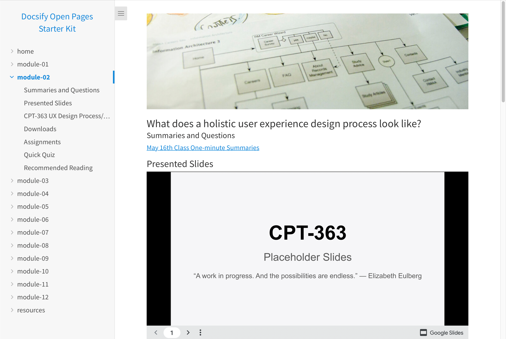
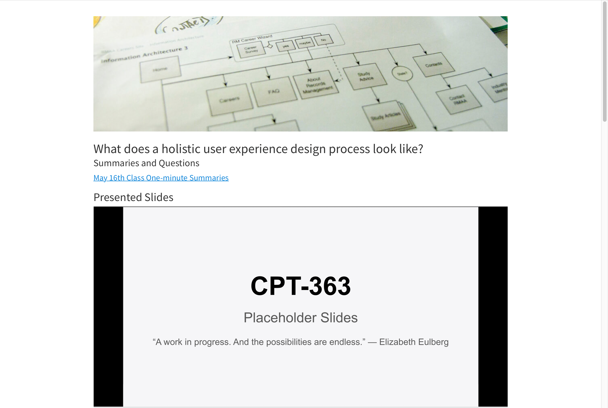

# Docsify Open Pages Starter Kit

> This is a starter kit to quickly create and maintain a collection of Markdown-based pages with the site generator [Docsify](https://docsify.js.org). Sidebar navigation items are automatically generated, and the entire Sibebar can be hidden when pages are linked to or seamlessly embeded into another system (i.e. LMS). Includes an optional "Edit this Page" link.

📸 Docsify Open Pages Screenshots
---

_Figure 1. Docsify Open Pages Starter Kit, with a Docsify site page on the left, and a Docsfy standalone page on the right including an optional table of contents. Explore a demo at [paulhibbitts.github.io/test-docsify-open-pages-starter-kit/#/](https://paulhibbitts.github.io/test-docsify-open-pages-starter-kit/#/)_

Docsify Page             |  Standalone Docsify Page |  ToC Standalone Docsify Page
:-------------------------:|:-------------------------:|:-------------------------:
  |   |  
https://paulhibbitts.github.io/test-docsify-open-pages-starter-kit/#/module-02  |  https://paulhibbitts.github.io/test-docsify-open-pages-starter-kit/#/module-02?standalone=true | https://paulhibbitts.github.io/test-docsify-open-pages-starter-kit/#/module-02?standalone=true&toc=true

🚀 GitHub Pages Quickstart
---
**Pre-flight Checklist**  

1. GitHub account

**Installation and Deployment**

1. Tap **Use this template** on the source repository (upper-right green button)

2. Choose the name for your new repository to contain the copied site files and then tap **Create repository from template**

3. Go to **Settings** of your newly created repository, tap the **Pages** tab (on the left-hand side), choose **main branch**, then **docs folder** and finally tap the **Save** button (see more details in the [Docsify documentation](https://docsify.js.org/#/deploy?id=github-pages))

4. And you're done! (view your new site using the provided URL on the **Pages** tab - it can take up to 10 minutes for your site to be initially available)

Do you use GitLab? You can also use Docsify with [GitLab Pages](https://docsify.js.org/#/deploy?id=gitlab-pages)!

✏️ Editing Your Docsify Site Pages on GitHub
---  

1. Go to the Docsify Markdown (.md) page in the `docs` folder of your repository you want to edit

2. Tap the **Pencil Icon** (top left-hand toolbar area) to start the editor

3. Scroll down to the bottom of the page and tap the **Commit changes** button to save your changes

[Learn more about creating pages in Docsify.](https://docsify.js.org/#/more-pages)

🔗 Activating the “Edit this Page” Link on Your Docsify Site
---   

1. At the top-level of your GitHub Repository copy the URL

2. Tap on the **docs** folder

2. Tap on the **index.html** file

3. Tap the **Pencil Icon** (top left-hand toolbar area) to start the editor

4. Find the line `var gitLinkRepoURL = '';` and enter the URL of your own GitHub Repository in between the two quotes and then scroll down to the bottom of the page and tap the **Commit changes** button to save your changes

💻 Locally Editing Your Docsify Site Pages
---  

**Editing Your Docsify Site Pages on Your Desktop**
1. Tap **Code** on your repository (upper-right green button)
2. Choose **Open Desktop** and follow the prompts, installing [GitHub Desktop](https://desktop.github.com/) if not already present
3. You will now be able to edit your Docsify site (in the `docs` folder) using the desktop editor of your choice (e.g. [Atom](https://atom.io/))
4. Use GitHub Desktop to push any changes to your repository.  

[Learn more about using GitHub Desktop](https://help.github.com/en/desktop/contributing-to-projects/committing-and-reviewing-changes-to-your-project).

You can also clone (i.e download) a copy of your repository to your computer and [run Docsify locally](https://docsify.js.org/#/quickstart) to preview your site. See the below video for details.

🖼 Using your Docsify Page Content in Other Systems
---  

The optional ‘standalone’ (all lowercase) URL parameter hides a site’s sidebar for seamlessly embedding Docsify page content within another platform such as Canvas LMS, Moodle, Microsoft Teams or being solely displayed in an existing or new Browser tab.

To only display Docsify page content, add the following to a Docsify page URL:

`?standalone=true`

For example, https://paulhibbitts.github.io/test-docsify-open-pages-starter-kit/#/resources would display a standard Docsify page while https://paulhibbitts.github.io/test-docsify-open-pages-starter-kit/#/resources?standalone=true would only display page content (i.e., no sidebar is shown).

To optionally show a page Table of Contents (based on included Headers), use the following:

`?standalone=true&toc=true`

For example, https://paulhibbitts.github.io/test-docsify-open-pages-starter-kit/#/resources?standalone=true would only display page content while https://paulhibbitts.github.io/test-docsify-open-pages-starter-kit/#/resources?standalone=true&toc=true would display a page Table of Contents on the right side of the page.

To optionally hide the 'Edit this Page' link, use the following:

`?standalone=true&hidegitlink=true`

For example, https://paulhibbitts.github.io/test-docsify-open-pages-starter-kit/#/resources would display a standard Docsify page while https://paulhibbitts.github.io/test-docsify-open-pages-starter-kit/#/resources?standalone=true&hidegitlink=true would only display page content (i.e., no sidebar is shown) and also hide the 'Edit this Page' link.

📚 Docsify and Markdown Resources
---
**Docsify**  
[Docsify Documentation](https://docsify.js.org/#/?id=docsifyg)  
[Docsify Basics by MichaelCurrin](https://michaelcurrin.github.io/docsify-js-tutorial/#/?id=docsify-basics)  

**Docsify Themable**  
[Docsify Themeable Documentation](https://jhildenbiddle.github.io/docsify-themeable/#/introduction)  
[Docsify Themeable GitHub](https://github.com/jhildenbiddle/docsify-themeable)  

**Markdown**  
[Markdown Cheat Sheet](https://warpedvisions.org/projects/markdown-cheat-sheet/)  
[Markdown Guide](https://www.markdownguide.org/)  

📼 Video Walkthrough of Local Docsify Install/Config
---
  
_Video 1. Generating Documentation Sites with GitHub and Docsify - Alysson Alvaran_

🙇‍Credits and Special Thanks
---
[Docsify Themeable](https://github.com/jhildenbiddle/docsify-themeable)   
